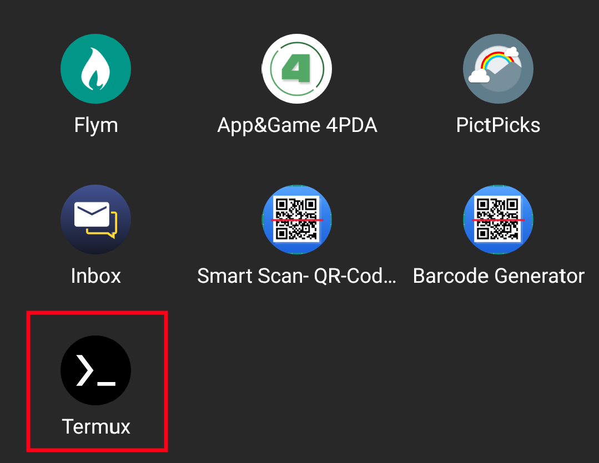
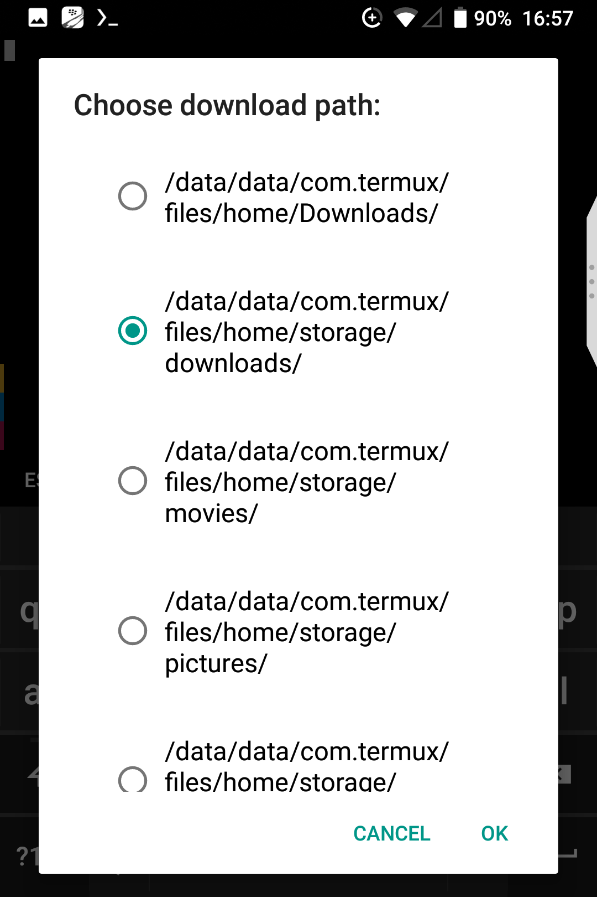
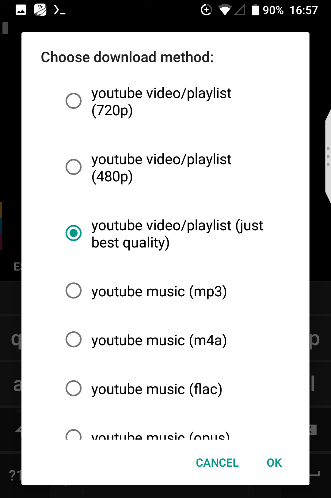

# Handy download script

Handy little script in form of **termux-url-opener**

**Features**:
- download video from youtube
- download audio from youtube
- stream audio from youtube
- download images from instagram, imgur, pinterest
- download anime from Animevost (_RUS only_)
- download torrent and regular files 

## Usage

1. Share link and choose termux



2. Choose destination folder 



3. Choose download method



4. Wait

5. Profit

## Installation 

Just run **this** in your _termux app_

``` bash
place for code
```


